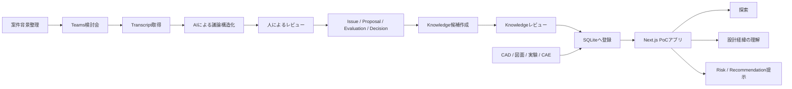

# プレス金型 設計ノウハウ活用PoC 概要

## 1. 目的

本PoCの目的は、プレス金型設計における「属人化」を、単なる情報共有不足ではなく、設計知識を扱う一連の行動として分解し、データ活用によってどこまで解決できるかを検証することである。

本PoCでは、Teamsの設計検討会録画・文字起こし、案件背景情報、CAD/図面/実験・解析データ等をつなぎ、設計者が以下を自力で行える状態を目指す。

1. **残す**：設計検討会で議論された設計案、判断理由、経験則、懸念、未解決事項を構造的に残す
2. **見つける**：「あのデータはどこか」「過去に似た実験はないか」を主体的に探せる
3. **理解する**：「なぜこの設計になったのか」を、採用案だけでなく却下案や議論経緯まで含めて理解できる
4. **適用する**：現在の設計案件に対し、過去知識をもとにリスクや検討候補を提示できる

PoCの主眼は、Teams録画を検索できるようにすることではなく、**設計者の会話・経験・判断を、案件の文脈付きで再利用可能な設計知識へ変換し、設計行為に戻せるかを示すこと**に置く。

---

## 2. PoCで扱う「属人化」の定義

| 段階 | 属人化している状態 | 代表的な困りごと | PoCでの解決方法 |
|---|---|---|---|
| 残す | 知識が人の頭や会話内に残る | 熟練者が話した経験則が記録されない | Teams検討会からIssue単位で議論構造を抽出 |
| 見つける | 情報の所在を知る人に依存 | 「あのデータどこ？」「似た実験は？」 | 案件・工程・材料・Issue・Asset横断で検索 |
| 理解する | 背景を知る人に依存 | 「なぜこの設計？」が図面だけでは分からない | Proposal/Evaluation/Decision/Evidenceを辿れるようにする |
| 適用する | 現案件への応用が熟練者依存 | 「どこがリスク？」「他案件ではどうした？」 | 案件コンテキストをもとにKnowledgeを提示 |

---

## 3. 対象範囲

### 対象案件
- 3案件程度
- 各案件は互いに類似している必要はない
- 商品が異なれば工法や設計ポイントが大きく異なることを前提とする
- まずは各案件の中で、背景情報・設計課題・議論・設計判断・関連データを一貫してつなぐ

### PoCで扱うデータ
- 案件背景
  - 商品
  - 用途
  - 対象部品
  - 生産工程
  - 対象加工
  - 設備
  - ワーク
  - 材料
  - 板厚
  - 搬送
  - 主な制約
- Teams設計検討会
  - 録画URL
  - Transcript
  - 参加者
  - 日時
- 設計関連データ
  - CAD
  - 図面
  - CADスクリーンショット
  - 実験結果
  - CAE解析結果
  - 説明資料
- 構造化データ
  - Issue
  - Proposal
  - Evaluation
  - Evidence
  - Decision
  - Knowledge

---

## 4. PoCの基本シナリオ

### シナリオA：過去データを探す

設計者が自分で以下を検索する。

- 「商品Aの接着後ワークの3Dモデルを見たい」
- 「この加工について過去の実験結果を確認したい」
- 「位置決めについて過去にどんな検討をしたか確認したい」

アプリから以下まで辿れることを確認する。

`検索 → Case → Issue → Asset / Evidence → 元データ`

---

### シナリオB：過去設計の経緯を理解する

設計者が過去案件の設計結果を見て、

> なぜこの構造になっているのか？

を確認する。

アプリ上で、

- Issue
- 検討されたProposal
- 各Proposalへの賛否
- 経験則
- 定量的根拠
- 懸念
- 採用/却下理由
- 未解決事項
- Decision
- 根拠となる録画・資料

を辿れることを確認する。

---

### シナリオC：現在案件へ設計知識を適用する

案件コンテキストや現在のIssueをもとに、アプリがKnowledgeを提示する。

例：

- 「この条件では○○がリスクになる可能性があります」
- 「この機能について、過去案件では○○構造を採用しています」
- 「実績のある案と、実績はないが性能上有望な案があります」
- 「過去の設計検討では、この条件を確認してから決定しています」

PoCでは高度な自動推論を完成させる必要はなく、構造化されたKnowledgeと条件をもとに、設計者に有用な候補を出せることを確認する。

---

## 5. PoCのデータフロー

---

## 6. PoCでの重要な割り切り

### 6.1 案件横断の類似性を前提にしない
PoC対象3案件が互いに独立していても問題ない。

最初の検証対象は、

- 1案件の知識をきちんと残せるか
- 案件内部で設計経緯を追えるか
- 必要なAssetを見つけられるか
- その案件から再利用可能なKnowledgeを抽出できるか

である。

案件横断推薦は、共通するKnowledgeが実際に存在する場合のみ検証する。

### 6.2 完全自動化を目的にしない
Teams TranscriptからAIで構造化候補を作成するが、人によるレビューを前提とする。

### 6.3 既存システムを置き換えない
CAD、図面、録画、実験データのファイル自体は既存保管場所に置き、PoC側ではAssetとしてメタデータとリンクを管理する。

### 6.4 本番DBを先に作らない
PoCではMarkdown/JSON + SQLiteを利用する。
本番化時にPostgreSQLへ移行可能な論理構造を維持する。

---

## 7. 成功判定

PoCでは以下を確認する。

### ① 残せるか
- 検討会の主要Issueを漏れなく抽出できる
- 採用案以外のProposal、却下理由、経験則も残せる

### ② 見つけられるか
- 人に聞かずに関連するCAD、図面、実験、過去Issueへ到達できる

### ③ 理解できるか
- 会議に参加していない設計者が「なぜその設計になったか」を理解できる

### ④ 適用できるか
- Knowledgeを現在の設計Issueに対する注意点・検討候補として提示できる
- 提示された情報が設計検討のきっかけとして有用である

---

## 8. PoCの成果物

- 3案件分のCaseデータ
- Teams Transcriptから構造化したIssueデータ
- Proposal / Evaluation / Evidence / Decisionデータ
- Knowledge 5〜10件程度を目安
- CAD・図面・実験結果等のAsset台帳
- SQLiteデータベース
- Next.js PoCアプリ
- 3D Viewer
- Risk / Recommendationの簡易提示機能
