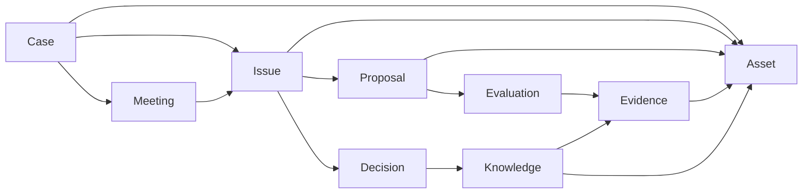

# プレス金型 設計ノウハウPoC オントロジー

## 1. 方針

PoCでは、完全な企業オントロジーを構築しない。

目的は、以下を成立させるために必要な最小構造を定義すること。

- 案件の背景が分かる
- 設計Issueを追える
- 複数案とその評価が残る
- 判断理由が追える
- 根拠データへ戻れる
- 案件からKnowledgeを抽出できる
- Knowledgeを設計時に再提示できる

PoCでは以下の8エンティティを中心とする。

1. Case
2. Meeting
3. Issue
4. Proposal
5. Evaluation
6. Evidence
7. Decision
8. Knowledge
9. Asset

※ Assetを含めると9エンティティ。

---

## 2. 全体関係



---

## 3. Case

### 役割
設計検討が行われた案件のコンテキストを保持する。

### 主な属性

```yaml
case_id:
case_name:

product:
  name:
  category:
  usage:

target_component:
process:
operation:
equipment:

workpiece:
  description:
  form:
  material:
  thickness:

transportation:
constraints:
notes:
```

### PoCでマスタ化しないもの
以下は文字列/タグで保持してよい。

- Product
- Material
- Equipment
- Process
- Workpiece

本番化時に必要なら独立Entity化する。

---

## 4. Meeting

### 役割
Teams設計検討会と構造化データをつなぐ。

### 属性

```yaml
meeting_id:
case_id:
date:
title:
participants:
recording_url:
transcript_path:
summary:
```

---

## 5. Issue

### 役割
「設計上、何を決める・解決する必要があったのか」を表す。

Issueを設計知識の中心単位とする。

### 属性

```yaml
issue_id:
case_id:
meeting_ids:

title:
category:

background:
design_objective:
constraints:

status:
  - open
  - decided
  - pending
  - experiment_required

related_assets:
tags:
```

### category例
PoCでは固定しすぎず、以下を初期候補とする。

- 加工方法
- 位置決め
- クランプ
- 搬送
- 工具構造
- 材料挙動
- 品質リスク
- 干渉
- 強度
- 寿命
- メンテナンス
- その他

---

## 6. Proposal

### 役割
Issueに対して議論された設計案を保持する。

採用案だけでなく、却下案・保留案・攻めた案も残す。

### 属性

```yaml
proposal_id:
issue_id:

name:
description:

proposed_by:
timestamp:

novelty:
  - established
  - proven_in_other_case
  - unproven_but_promising
  - experimental
  - unknown

status:
  - candidate
  - selected
  - rejected
  - pending
```

---

## 7. Evaluation

### 役割
Proposalに対する評価を保持する。

「A案はダメだった」という結果だけでなく、なぜそう評価されたかを残す。

### 属性

```yaml
evaluation_id:
proposal_id:

viewpoint:
  - performance
  - quality
  - manufacturability
  - accuracy
  - reliability
  - cost
  - lead_time
  - maintenance
  - equipment_constraint
  - risk
  - other

stance:
  - positive
  - negative
  - conditional
  - neutral

description:
conditions_for_success:
risks:
uncertainties:

speaker:
timestamp:
evidence_ids:
```

---

## 8. Evidence

### 役割
Proposal/Evaluation/Decisionの根拠を保持する。

### type

```yaml
type:
  - past_case
  - experiment
  - simulation
  - production_result
  - personal_experience
  - drawing
  - cad
  - measurement
  - standard
  - assumption
  - other
```

### 属性

```yaml
evidence_id:
type:
description:

source_case_id:
source_asset_id:

speaker:
timestamp:

reliability:
  - high
  - medium
  - low
  - unknown
```

---

## 9. Decision

### 役割
Issueに対する最終的な判断を保持する。

### 属性

```yaml
decision_id:
issue_id:

selected_proposal_ids:
decision:
reason:

rejected_proposals:
remaining_risks:
open_questions:
required_follow_up:

status:
  - decided
  - provisional
  - pending

timestamp:
```

---

## 10. Knowledge

### 役割
特定案件のDecisionを、別の設計時にも参照可能な形へ一般化する。

DecisionとKnowledgeは分ける。

### 属性

```yaml
knowledge_id:
title:

problem:
knowledge:
reason:

applies_when:
does_not_necessarily_apply_when:

related_issue_categories:
related_processes:
related_operations:
related_materials:
related_workpiece_features:

source_case_ids:
source_issue_ids:
source_decision_ids:
evidence_ids:

maturity:
  - observation
  - hypothesis
  - case_decision
  - case_verified
  - multi_case_verified
  - design_guideline

confidence:
  - high
  - medium
  - low

review_status:
  - candidate
  - reviewed
  - approved
```

---

## 11. Asset

### 役割
CAD、図面、画像、解析、実験結果、資料などの実データへの入口。

PoCではファイル自体をDBに格納せず、元ファイルへの参照を保持する。

### 属性

```yaml
asset_id:
case_id:

type:
  - cad
  - drawing
  - image
  - simulation
  - experiment
  - presentation
  - document
  - video
  - other

title:
description:

source_system:
url:
local_path:

revision:
created_at:

related_issue_ids:
related_proposal_ids:
related_evidence_ids:
```

---

## 12. PoCでの検索軸

最低限以下で検索できるようにする。

### Case
- 商品
- 工程
- 加工
- 材料
- 設備
- ワーク
- 制約

### Issue
- Issue名
- category
- タグ

### Knowledge
- 問題
- 適用条件
- 工程
- 加工
- 材料
- Issue category

### Asset
- 種別
- 案件
- 関連Issue

---

## 13. PoCでやらないこと

- Product ontologyの完全整備
- 材料マスタとの自動連携
- 設備マスタとの自動連携
- PDMとの双方向同期
- 全CADフィーチャーの意味付け
- Knowledge Graph専用DB
- 企業全体の標準用語体系の完成

これらはPoCで必要性が確認された後に拡張する。
