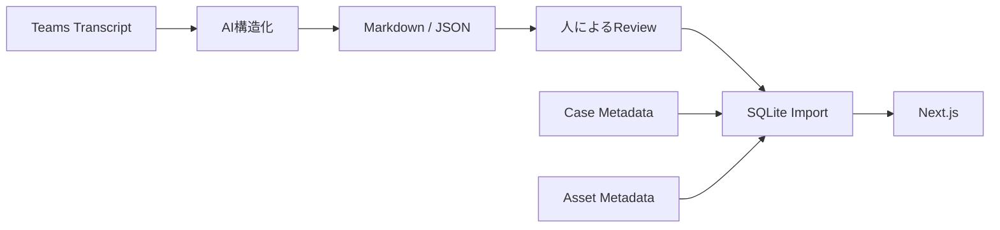

# 設計ノウハウPoC アプリ 技術構成・設計仕様

## 1. 方針

PoCであっても、単なるデータ表示ツールではなく、将来の設計業務での利用イメージが伝わるUIを作る。

Streamlitは使用せず、Next.jsを中心に構築する。

理由：

- UI/UXを設計業務に合わせて作り込める
- 3D ViewerをWeb上に統合しやすい
- AIエージェントによる実装支援を活用しやすい
- PoC後もプロダクトコードとして発展させやすい
- 「PoC専用の使い捨て画面」になりにくい

---

## 2. 技術構成

### Frontend

- Next.js
- TypeScript
- React
- Tailwind CSS
- shadcn/ui 等のUIコンポーネント
- Three.js または React Three Fiber
- Markdown renderer

### Backend

PoCでは2案。

#### 推奨
Next.js Route Handlers / Server Actions

PoC規模ならAPIを別サーバーに分離しない。

#### 将来
FastAPI等へ分離可能。

---

## 3. データストア

### PoC

- Markdown / JSON
  - AIが生成する中間データ
  - 人がレビューしやすい
- SQLite
  - アプリ検索
  - Entity間Relation
  - FTS検索

### 将来

- PostgreSQL
- pgvector
- RLS
- 外部システム連携

PoC段階ではPostgreSQLに依存しない。

---

## 4. データ生成パイプライン



AI構造化処理は、アプリ本体から独立したPython/Nodeスクリプトでもよい。

---

## 5. 3D Viewer

### PoC方針

NXとの自動連携は行わない。

対象案件の代表モデルをWeb表示可能形式へ手動変換する。

候補：

- glTF
- GLB

### Viewer機能

PoCでは以下。

- 回転
- ズーム
- パン
- Fit
- 部品表示/非表示
- 部品選択
- 簡易ハイライト
- Knowledge/Issueとの関連表示

### PoCで必須ではない

- NX Feature IDとの完全連携
- 面単位のKnowledge紐付け
- PMI完全再現
- CAD編集

---

## 6. 画面構成

### 6.1 Home / Search

目的：
過去案件・Issue・Knowledge・Assetを主体的に探す。

検索対象：

- Cases
- Issues
- Knowledge
- Assets

検索例：

- 商品名
- 材料
- 工程
- カット
- 位置決め
- メッキ
- 実験
- CAE

表示：

- 種別
- タイトル
- 案件
- 関連Issue
- 概要

---

## 6.2 Case Detail

案件の全体像を把握する画面。

### Header
- 案件名
- 商品
- 用途
- 工程
- 加工
- 材料
- 設備

### Main

3カラムを基本とする。

```text
┌──────────────────────────────────────────┐
│ Case Header                              │
├────────────┬────────────────┬────────────┤
│ Navigation │ 3D / Drawing   │ Knowledge  │
│            │ Viewer         │ / Risk     │
│ Issues     │                │            │
│ Assets     │                │            │
│ Meetings   │                │            │
└────────────┴────────────────┴────────────┘
```

---

## 6.3 Issue Detail

PoCで最重要の画面。

### 表示

#### Issue
- 背景
- 目的
- 制約
- Status

#### Proposal一覧
各Proposalをカード表示。

- 案名
- 概要
- 実績レベル
- 採用/却下/保留
- 発言者

#### Evaluation
Proposalごとに、

- 良い点
- 悪い点
- 条件
- リスク
- 不確実性
- Evidence

を表示。

### Discussion Timeline

議論の流れを時系列表示。

例：

```text
10:32 A案提示
↓
10:35 過去案件の不具合指摘
↓
10:38 B案提示
↓
10:42 B案の公差懸念
↓
10:48 B案を暫定採用
```

各イベントからTeams録画Timestampへ移動できる。

### Decision

- 採用案
- 判断理由
- 却下案と理由
- 残リスク
- 未決事項

---

## 6.4 Knowledge Detail

### 表示

- Knowledge title
- 問題
- 推奨内容
- 理由
- 適用条件
- 適用外/注意条件
- 成熟度
- 信頼度

### Source

- 元Case
- 元Issue
- Decision
- Evidence
- Teams録画
- CAD/図面

「一般化されたKnowledge」から必ず元の設計議論へ戻れる設計とする。

---

## 6.5 Asset Viewer

### Asset一覧

- CAD
- Drawing
- Image
- Experiment
- CAE
- Presentation
- Video

### CAD

3D Viewerで表示。

### Drawing / Image

Web画面内でプレビュー。

### Experiment / CAE

PoCでは、

- 概要
- 代表画像
- 元データリンク

まででよい。

---

## 6.6 Design Assistant

現在の案件/Issueを前提にKnowledgeを提示する補助領域。

チャット単体を主UIにしない。

### 表示例

#### Risk

> 積層後ワークのため、穴位置を基準とした位置決めでは精度変動に注意が必要です。

#### Recommendation

> 過去案件では外形位置決めが採用されています。

#### Why

> 積層工程後に穴位置精度が保証できなかったため。

#### Source

> Case A / Issue「位置決め方法」

### 重要
AI回答だけで終わらず、必ずKnowledge / Issue / Evidenceへリンクする。

---

## 7. 検索仕様

### Step 1：構造検索

以下をフィルタ可能にする。

- Case
- Product
- Process
- Operation
- Material
- Issue category
- Asset type
- Knowledge maturity

### Step 2：全文検索

SQLite FTS5を使用。

対象：

- Case description
- Issue
- Proposal
- Evaluation
- Knowledge
- Asset metadata

### PoCで意味検索は任意

Embedding/Vector Searchは、全文検索で不足が見えた場合に追加する。

---

## 8. Recommendation仕様

PoCでは高度な推論エンジンを作らない。

### 入力

- Current Case metadata
- Current Issue category
- 設計者が入力した相談内容

### 候補抽出

1. metadata一致
2. Issue category一致
3. Keyword/FTS検索
4. Knowledge maturityを考慮

### 出力

- Risk
- Recommendation
- Related Knowledge
- Past Decision
- Evidence

### 表示ルール

Knowledge maturityを必ず表示する。

例：

- Case decision
- Case verified
- Design guideline

「一案件の事例」を「標準ルール」と誤認させない。

---

## 9. DBテーブル案

最低限以下。

```text
cases
meetings
issues
proposals
evaluations
evidence
decisions
knowledge
assets

issue_meetings
proposal_evidence
knowledge_evidence
knowledge_cases
issue_assets
```

PoCでは一部JSON列を使用してもよい。

---

## 10. ディレクトリ案

```text
project/
├─ app/
│  ├─ cases/
│  ├─ issues/
│  ├─ knowledge/
│  ├─ search/
│  └─ api/
│
├─ components/
│  ├─ viewer/
│  ├─ issue/
│  ├─ knowledge/
│  └─ search/
│
├─ data/
│  ├─ cases/
│  ├─ meetings/
│  ├─ knowledge/
│  └─ assets/
│
├─ db/
│  ├─ schema/
│  └─ poc.sqlite
│
├─ scripts/
│  ├─ import-md.ts
│  └─ import-json.ts
│
└─ public/
   └─ models/
```

---

## 11. UI/UX原則

### 1. Chat中心にしない
設計者は探索・閲覧・比較を行うため、情報構造を画面上に見せる。

### 2. 3D/図面を文章と分離しない
IssueやKnowledgeを見ながら対象形状を確認できる配置にする。

### 3. 結論だけを見せない
ProposalとEvaluationを見せる。

### 4. Evidenceまで1〜2操作で戻れる
AIやKnowledgeをブラックボックス化しない。

### 5. 情報の確実性を明示する
- proven
- unproven
- assumption
- low confidence
等をUIで判別できるようにする。

---

## 12. PoC実装の優先順位

### Must
- Case一覧/詳細
- Issue詳細
- Proposal/Evaluation表示
- Decision表示
- Assetリンク
- Teams Timestampリンク
- Knowledge詳細
- 検索
- 3D Viewer

### Should
- Discussion Timeline
- Risk/Recommendation表示
- Drawing preview
- 関連Knowledge表示

### Could
- Vector Search
- AI Chat
- 3D部品とIssueの双方向連携
- 自動3D変換

---

## 13. PoC完成時に確認したい問い

1. Teams検討会から、設計者が後で必要とする議論を十分残せたか
2. 必要な過去Assetへ人に聞かず到達できるか
3. 過去設計の背景と却下案まで理解できるか
4. Knowledge化することで設計時の注意点や検討候補を提示できるか
5. 3D/図面をKnowledgeと一緒に見ることで理解が向上するか
6. このデータ構造を別案件へ追加していけるか
7. 本番システムへ発展させる価値があるか
